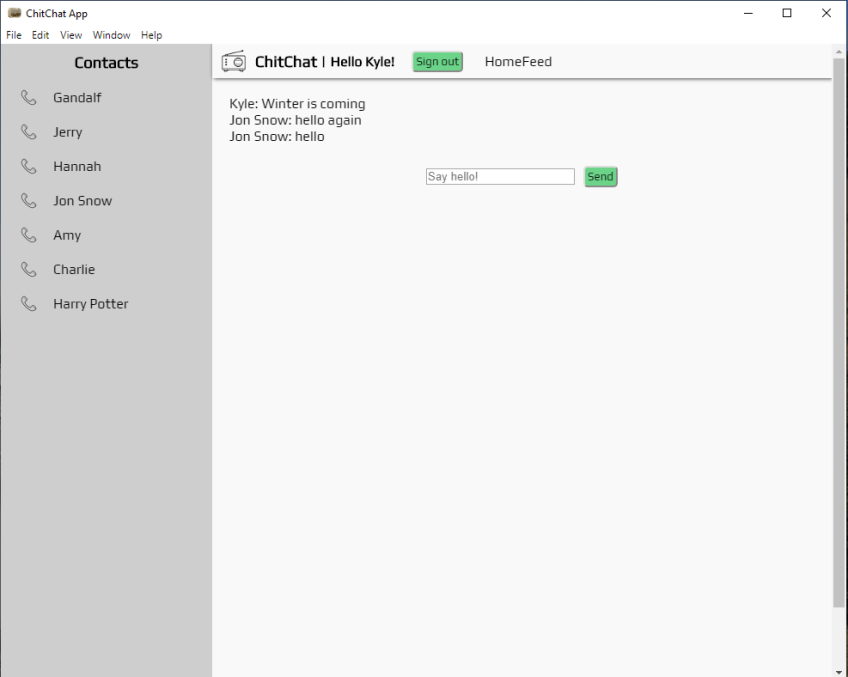

*<h1 align = "center"> Welcome to ChitChat**


<br>

**<h2 align = "center">
  <a href="#✅requirements">Requirements</a> •
  <a href="#💻setup">Setup</a> •
  <a href="#🔧technologies-used">Technologies</a> •
  <a href="#known-bugs">Known Bugs</a> •  
  <a href="#the-author">Author</a> •
  <a href="#📘 license">License</a>**

<br>
<h2 align = "center">

**ABOUT**

ChitChat is an instant messaging desktop application that allows user to collaborate in real time. 

</p>


## **✅REQUIREMENTS**

* Install [Git v2.62.2+](https://git-scm.com/downloads/)
* Install [Node.js](https://nodejs.org/en/download/)
* Install [Visual Studio Code](https://code.visualstudio.com/)

## **Description of Structure**
  Users first come into a sign in landing page where they can choose to either log in or create a new profile. After that, the application redirects to a site control page which consists of several components: a header navigational component, a multifunctional utility screen showing chats and homefeed, and a utility bar which houses all current contacts. From here, a user may easily respond to, review, and initiate real time conversations through their contacts list. To initiate a new chat, view an old chat, or continue an ongoing conversation, simply select the desired contact in the utility bar to bring up the chat component in the utility screen. 


  

## **User Stories**

| Spec | Input | Output | Status |
| :------------- | :------------- | :------------- | :------------- | 
| As a user I can sign up for a profile |  |   | True |
| As a user I can start a text chat with another user |  |   | True |
| As a user my text chat will update in real time |  |   | True |


## **💻SETUP**

Copy this url to clone this project to your local system:
```html
https://github.com/hubba180/ChitChat
```

<br>

Once copied, select "Clone Repository" from within VSCode & paste the copied link as shown in the image below.


<br>

With the project open to the root directory, navigate to the production directory with the following command in your terminal.
```js 
cd chit_chat
```

Then, install the necessary packages with the following command
```js 
npm install
```

users will need to add their own .env file to the project. Enter this command in the root directory to create a new file.
```js
touch .env
```

Now, populate the file in the following format. Note: please insert your credentials within the quotations. 
```js
REACT_APP_FIREBASE_API_KEY = "YOUR-UNIQUE-CREDENTIALS"
REACT_APP_FIREBASE_AUTH_DOMAIN = "YOUR-PROJECT-NAME.firebaseapp.com"
REACT_APP_FIREBASE_DATABASE_URL = "https://YOUR-PROJECT-NAME.firebaseio.com"
REACT_APP_FIREBASE_PROJECT_ID = "YOUR-PROJECT-FIREBASE-PROJECT-ID"
REACT_APP_FIREBASE_STORAGE_BUCKET = "YOUR-PROJECT-NAME.appspot.com"
REACT_APP_FIREBASE_MESSAGING_SENDER_ID = "YOUR-PROJECT-SENDER-ID"
REACT_APP_FIREBASE_APP_ID = "YOUR-PROJECT-APP-ID"
```

Next, build the project with the following command. This will take a few minutes
```js 
npm run build
```

Once the project is built, navigate into the dist folder and double click the file named ```ChitChat Setup 0.1.0``` to start installing the program. Once the program is installed double click the ChitChat desktop icon to start your own local version of the project.


## **🔧Technologies Used**

_**Written in:** [Visual Studio Code](https://code.visualstudio.com/)_

_**Database Mgmt:** [Firebase/Firestore](https://firebase.google.com/)_

_**Language:** JavaScript_

_**Other Technologies:** [Electron](https://www.electronjs.org/), [React](https://reactjs.org/)_

<br>


## **Known Bugs**

_**Messages Display out of order:** 10/9/2020_

_**Input doesn't clear on send:** 10/9/2020_

<br>


## **The Author**

 [<br /><sub><b>Kyle Hubbard</b></sub>](https://www.linkedin.com/in/k-j-hubbard/)<br />        


<br>

## **License**
[](https://opensource.org/licenses/MIT)

Copyright (c) 2020 **_Kyle Hubbard, Stickerslug Inc._**